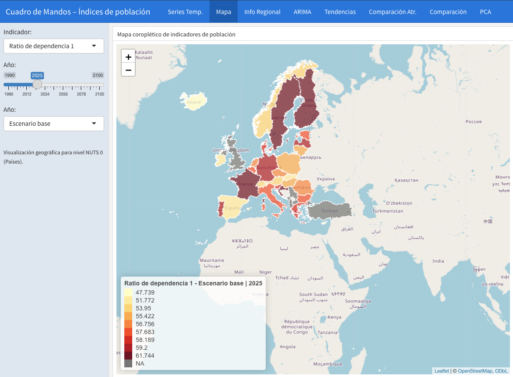

# La balanza inclinada — El problema de la población envejecida en Europa

Análisis demográfico de los países europeos centrado en el envejecimiento de la
población, con un cuadro de mandos interactivo, modelos de predicción de series
temporales y análisis multivariante. Datos oficiales de **Eurostat**.


> 📊 **Dashboard interactivo (Shiny):** se ejecuta en local — ver [Cómo ejecutarlo](#cómo-ejecutarlo)
> 📄 **Memoria del proyecto:** [https://xami650.github.io/old_europe/]

## Vista del cuadro de mandos



> El dashboard está construido con `flexdashboard` + `shiny`, por lo que necesita un
> servidor R en ejecución; no se puede servir como página estática. El código fuente
> está en `R/DashboardMaximoPR.Rmd` y se lanza en local con las instrucciones de abajo.

---

## Sobre el proyecto

Europa tiene una de las poblaciones más envejecidas del mundo, pero el fenómeno no
afecta por igual a todos los países. Este proyecto analiza esa heterogeneidad
territorial: cómo evolucionan los grupos de edad y las tasas de dependencia, qué
patrones distinguen a unos países de otros y cuál es la posición de España en el
contexto europeo.

Se siguió la metodología **CRISP-DM**, desde la comprensión y limpieza de los datos
hasta el modelado, la evaluación y el despliegue del dashboard.

### Objetivos

- Examinar la estructura poblacional europea mediante indicadores clave.
- Comparar la evolución demográfica entre países e identificar patrones territoriales.
- Analizar en detalle la situación de España frente al resto de Europa.
- Construir un cuadro de mandos interactivo para explorar los datos dinámicamente.
- Estimar la evolución futura de indicadores con modelos **ARIMA**.

## Tecnologías

- **Lenguaje:** R (RStudio, RMarkdown)
- **Datos:** `eurostat`, `tidyverse` (dplyr, tidyr), `readxl` / `openxlsx`
- **Visualización:** `plotly`, `ggplot2`, `leaflet` (mapas coropléticos), `highcharter`, `DT`
- **Series temporales:** `tsibble`, `fable`, `fabletools` (modelos ARIMA con intervalos de confianza)
- **Análisis multivariante:** PCA
- **Dashboard:** `shiny`, `flexdashboard`

## Estructura del repositorio

```
.
├── img/        Imágenes y capturas
├── data/       Datos de partida (Eurostat, geometrías NUTS, auxiliares ODS)
├── R/          Funciones auxiliares y código del dashboard
├── memoria/    Memoria del proyecto en RMarkdown
└── docs/       Memoria renderizada (HTML) servida con GitHub Pages
```

## Cómo ejecutarlo

```r
# Instalar dependencias
install.packages(c(
  "tidyverse", "eurostat", "readxl", "openxlsx", "leaflet",
  "plotly", "ggplot2", "tsibble", "fable", "fabletools",
  "DT", "highcharter", "shiny", "flexdashboard"
))

# Renderizar la memoria
rmarkdown::render("memoria/MemoriaProyectoPersonalAEDVMaximoProsperiReynoso.Rmd")

# Lanzar el dashboard
rmarkdown::run("R/DashboardMaximoPR.Rmd")
```

## Principales conclusiones

- La proporción de población mayor de 65 años crece de forma sostenida en casi todos
  los países, mientras la población joven y la población activa descienden.
- La tasa de dependencia aumenta **incluso en escenarios favorables** (alta migración
  o baja mortalidad): el envejecimiento es estructural.
- Los modelos ARIMA confirman tendencias ascendentes claras; la banda de confianza
  crece con el horizonte temporal pero no revierte la tendencia.

## Líneas de trabajo futuro

Modelos predictivos adicionales (Prophet, ETS, híbridos ARIMA + ML), extensión a
niveles territoriales NUTS 1 / NUTS 2, enriquecimiento con indicadores económicos
(PIB, empleo, gasto social) y clustering de perfiles de riesgo demográfico.

---

**Autor:** Máximo Prosperi Reynoso · Grado en Ciencia e Ingeniería de Datos, ULPGC
